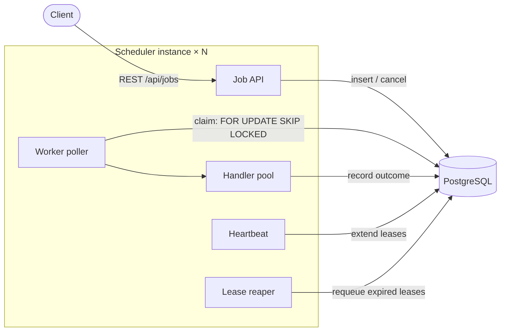

# Distributed Job Scheduler

[](https://github.com/ahmet-keles/distributed-job-scheduler/actions/workflows/ci.yml)

A distributed job scheduling platform built with Java 21, Spring Boot, and
PostgreSQL. Jobs are submitted over a REST API, persisted durably, and
executed by competing worker processes that coordinate purely through
database row locking — no message broker, no coordination service, and no
single point of failure in the execution path.

**Milestone 1** (this repository today): the durable core — API, persistence,
claiming, leases, retries, execution history, crash recovery.

## What it does

- **REST API** to create, inspect, list, and cancel jobs
- **Immediate and delayed jobs** — run now, after a delay, or at an instant
- **Competing workers**: any number of app instances poll for due jobs and
  claim them with `SELECT … FOR UPDATE SKIP LOCKED` — at most one claim is
  current at any time, claimers never block each other, and stale completions
  are fenced out (see the failure model for the one overlap the lease model
  allows)
- **Leases + heartbeats**: a claim is a lease, renewed while the worker is
  alive; a reaper returns expired leases to the queue, so a crashed or
  partitioned worker's jobs are re-executed instead of stuck
- **Bounded retries** with deterministic exponential backoff, ending in a
  terminal `FAILED` state with the last error preserved
- **Execution history**: one immutable attempt row per execution, including
  attempts written off as `ABANDONED` by crash recovery
- **Job states**: `PENDING → RUNNING → SUCCEEDED | FAILED`, plus `CANCELLED`
  for jobs cancelled before a worker picked them up

## Architecture



Every box inside the instance runs in **each** deployed instance; instances
are identical and stateless, and PostgreSQL is the only shared state. Any
instance's reaper can recover any other instance's abandoned jobs.

### Execution model

1. **Claim** — one short transaction locks up to N due `PENDING` rows
   (`FOR UPDATE SKIP LOCKED`), flips each to `RUNNING` with the worker's id
   and a lease deadline, and opens an attempt-history row. `SKIP LOCKED`
   partitions due jobs between concurrent workers without blocking.
2. **Execute** — the job's handler (resolved by `type`) runs on a dedicated
   thread pool, strictly outside any transaction, so slow work never pins
   locks or connections. The poller claims only as many jobs as it has free
   handler threads.
3. **Complete** — a second short transaction re-locks the row and records
   `SUCCEEDED`, or `FAILED` with the retry policy applied: back to `PENDING`
   at `now + initial·multiplier^(n−1)` (capped) while attempts remain,
   terminal `FAILED` once exhausted.
4. **Heartbeat** — while jobs run, the worker extends the lease of every
   `RUNNING` row it owns whose lease is still live, in one UPDATE, on a
   schedule that startup validation forces to be shorter than the lease. An
   already-expired lease is never extended — it belongs to the reaper.
5. **Reap** — a sweeper on every instance locks `RUNNING` rows whose lease
   deadline passed, closes their open attempt as `ABANDONED`, and requeues or
   fails the job exactly like an ordinary failure.

### Data model

| Table | Purpose |
|---|---|
| `jobs` | Current state: status, schedule, attempts/max, claim owner + lease, last error. CHECK constraints enforce the status/claim invariant at the schema level. |
| `job_attempts` | Append-only history: one row per started attempt with worker, timestamps, outcome (`SUCCEEDED`/`FAILED`/`ABANDONED`), and error. `UNIQUE (job_id, attempt_number)`. |

Schema is managed by Flyway (`src/main/resources/db/migration`); Hibernate
runs in `validate` mode only.

## Failure model

Execution is **at-least-once**. The design makes every crash window explicit:

| Failure | Outcome |
|---|---|
| Worker crashes **before the claim commits** | Nothing happened: the job is still `PENDING`, the locks die with the connection. |
| Worker crashes **after claiming, before/during execution** | The job stays `RUNNING` until its lease deadline passes; the reaper then closes the attempt as `ABANDONED` and requeues (or fails) it. The handler may or may not have run — this is the at-least-once window. |
| Worker crashes **after execution, before recording the outcome** | Same as above: the verdict is lost, the lease expires, the job is re-executed. Handlers must be idempotent or tolerate duplicate execution. |
| Worker is **paused/partitioned past its lease** (a "zombie") | The reaper reclaims the job; a late heartbeat cannot resurrect the expired lease. When the zombie wakes and reports its stale verdict, the fence rejects it: a completion is applied only when it matches both the claim's worker **and** its attempt number, so a stale attempt can never write the current one's state — even when the same worker process holds the replacement claim. Note the zombie's **handler may still be executing** while the replacement attempt runs: the database state has one owner, handler execution can overlap. |
| Handler **throws** | The attempt is recorded `FAILED`; the job retries with exponential backoff until `max_attempts`, then goes terminal `FAILED` with the error preserved. |
| **Cancel races a claim** | The two transactions serialize on the row lock. If cancel wins, the claim never sees the job; if the claim wins, cancel returns `409 Conflict` — a job is never yanked from under a running worker. |
| **Database is down** | The API and workers fail their operations; nothing is lost or duplicated because every transition is a single ACID transaction. Work resumes when the database does. |

Two invariants carry all of this:

1. Every state transition happens in one transaction over a row the
   transaction holds locked.
2. A completion is applied only when it matches both the claim's worker id
   and its current attempt number — the attempt number is a fencing token,
   so a stale attempt has zero effect on job state or attempt history.

What the invariants do **not** provide: exactly-once handler execution.
`SKIP LOCKED` guarantees only one *claim* is current at a time, but after a
lease is lost the old handler may still be running while the replacement
attempt executes — duplicate and even overlapping handler execution is
possible. Handlers that perform external side effects must be idempotent or
carry their own fencing/idempotency mechanism (e.g. an idempotency key
derived from the job id and attempt number).

## API

```bash
# Run now
curl -X POST localhost:8080/api/jobs \
  -H 'Content-Type: application/json' \
  -d '{"type": "noop", "payload": "{\"anything\": true}"}'

# Run in 10 minutes (or use "scheduledAt": "2026-01-01T09:00:00Z")
curl -X POST localhost:8080/api/jobs \
  -H 'Content-Type: application/json' \
  -d '{"type": "sleep", "payload": "{\"millis\": 2500}", "delaySeconds": 600}'

# Bounded retries (default 3, max 20)
curl -X POST localhost:8080/api/jobs \
  -H 'Content-Type: application/json' \
  -d '{"type": "always-fail", "maxAttempts": 5}'

# Inspect one job, attempt history included
curl localhost:8080/api/jobs/{id}

# List, newest first; optional status filter and limit
curl 'localhost:8080/api/jobs?status=FAILED&limit=20'

# Cancel a PENDING job (RUNNING or terminal -> 409, unknown -> 404)
curl -X POST localhost:8080/api/jobs/{id}/cancel
```

Built-in job types: `noop` (succeeds), `sleep` (`{"millis": n}`),
`always-fail` (exercises the retry path). Add your own by implementing
`JobHandler` as a Spring bean; duplicate types fail startup.

## Running locally

Requirements: Docker; Java 21 only if you run the app on the host.

```bash
cp .env.example .env            # set POSTGRES_PASSWORD
docker compose up -d --build --wait   # PostgreSQL + the scheduler
curl localhost:8080/actuator/health
```

To develop on the host instead:

```bash
docker compose up -d postgres
set -a; source .env; set +a
./mvnw spring-boot:run
```

Worker behaviour (poll interval, batch size, concurrency, lease duration,
heartbeat/reaper cadence, retry backoff) is configured under `app.worker.*`
in `application.properties`; every bound is validated at startup, and
`app.worker.enabled=false` turns an instance into an API-only node.

## Tests

```bash
./mvnw test        # 43 tests; Docker must be running
```

- **Unit**: state-machine transitions, ownership guards, retry backoff
  arithmetic, handler registry.
- **Integration (Testcontainers, real PostgreSQL)**: the API surface;
  claim semantics including two workers claiming concurrently with proven
  disjoint results; retry-to-terminal with full history; lease expiry,
  crash recovery, and the zombie-verdict guard; heartbeats.
- **End-to-end**: the scheduled loop enabled for real — submit through the
  service, watch the poller claim, execute, retry, and complete.

CI (`.github/workflows/ci.yml`) runs the same suite on every push and pull
request to `main`, with a fail-fast Docker preflight and retried image
pre-pulls.

## Project layout

```
src/main/java/com/ahmetkeles/jobscheduler/
├── api/        REST controller, request/response types, error mapping
├── domain/     Job + JobAttempt aggregates: every legal state transition
├── repository/ Spring Data JPA + the locking queries (SKIP LOCKED)
├── service/    API-facing operations (create/get/list/cancel)
└── worker/     Claim service, poller, handler registry + built-ins,
                heartbeat, lease reaper, retry policy
```

## Roadmap

Deliberately **not** in milestone 1: recurring/cron schedules, job
dependency graphs, priorities, a queue/broker (RabbitMQ), distributed
caching (Redis), WebSocket progress streaming, richer observability, and
cloud deployment. Each arrives in a later milestone on top of the durable
core this milestone establishes.
